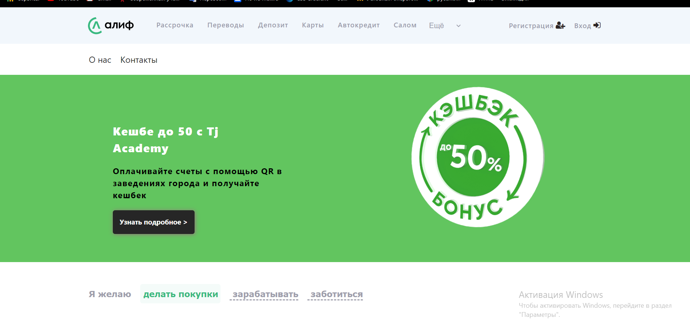
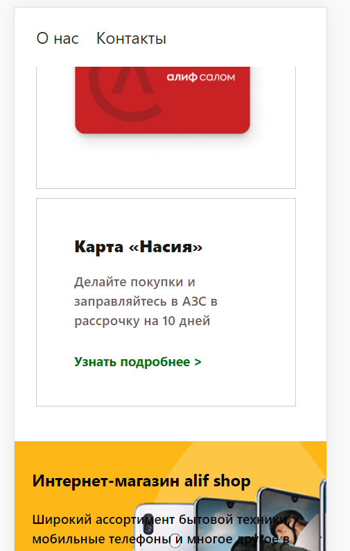
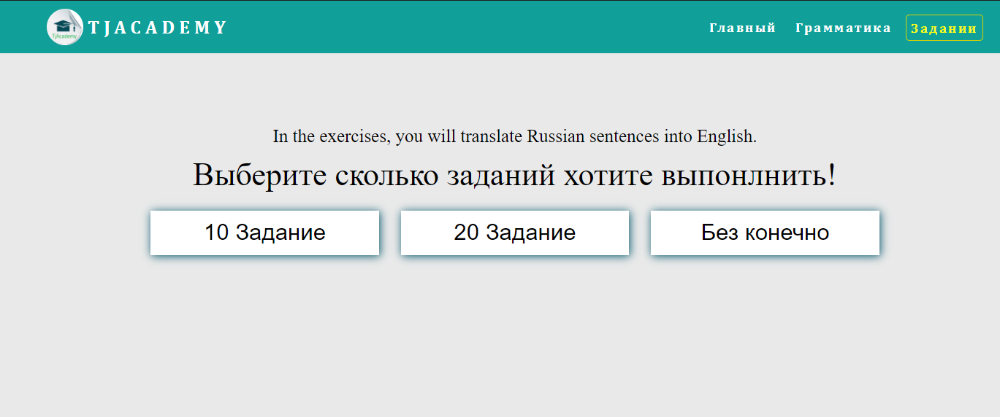
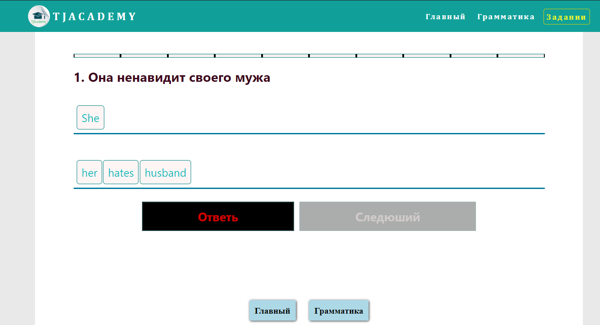

# frontentProjects

1. <h3>You can see bankAcademy project on browser<a href='https://umarovsafarbek.github.io/frontentProjects/bankAcademy/index.html'  target="_blank"> Click here to see </a></h3>
<h1>In PC</h1>

<h1>In phone</h1>

2. <h3>See my English application web on browser!!!!! <a href="https://umarovsafarbek.github.io/frontentProjects/englishApp/lessons/exercise.html"  target="_blank">Click here</a> to see App</h3>
It is look like duolingo 

Exersice!

